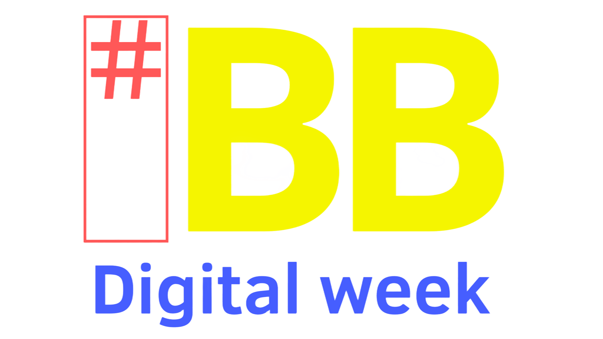

<div align="center">
  
</div>

---

# BB Digital Week - Frontend

Sistema web frontend para gerenciamento e organização da **BB Digital Week**. Desenvolvida em **React + Vite**, a plataforma oferece uma interface moderna e intuitiva para administrar sessões, trilhas, atividades, palestrantes, espaços e o cronograma geral do evento.

## 📋 Funcionalidades

### 📊 Dashboard
- Visão geral e estatísticas do evento em tempo real.
- Indicadores de performance e métricas rápidas.
- Navegação centralizada e intuitiva.

### 📅 Cronograma
- Visualização completa da programação do evento.
- Organização dinâmica por horários.
- Exibição de sessões e atividades categorizadas por trilhas.

### ⚙️ Gestão de Conteúdo
- Cadastro, edição e listagem de:
  - Sessões e Trilhas
  - Atividades e Palestrantes
  - Espaços Físicos/Virtuais e Horários

### ✅ Fluxo de Aprovação e Moderação
- Propostas enviadas permanecem inicialmente em estado **"Em Andamento"**.
- Aprovação ou rejeição controlada pelo organizador.
- Gestão completa do status dos conteúdos.

### ✨ Recursos Adicionais
- Autenticação e login de usuários.
- Menus responsivos (Sidebar e Navbar).
- Alertas de similaridade entre conteúdos utilizando inteligência artificial.
- Interface totalmente responsiva (Mobile e Desktop).

---

## 🛠️ Tecnologias Utilizadas

- **React 18** - Biblioteca principal para construção das interfaces.
- **Vite** - Bundler e ambiente de desenvolvimento ultrarrápido.
- **JavaScript (ES6+)** - Lógica e controle de estado.
- **CSS3 e HTML5** - Estruturação e estilização da plataforma.

---

## 📁 Estrutura do Projeto

```text
src/
├── components/   # Componentes reutilizáveis (Navbar, Sidebar, etc)
├── pages/        # Telas da aplicação (Login, Dashboard, Grade, etc)
├── data/         # Mock data e contextos temporários
├── services/     # Integração com a API Backend
├── styles/       # Arquivos de estilização globais e locais
├── App.jsx       # Componente raiz e rotas principais
└── main.jsx      # Ponto de montagem da aplicação
```

---

## 🚀 Como Executar o Projeto

### Pré-requisitos
- [Node.js](https://nodejs.org/) (Versão 18 ou superior)
- npm ou yarn

### Instalação

1. Clone o repositório:
   ```bash
   git clone https://github.com/seu-usuario/bbdigitalweek.git
   cd bbdigitalweek
   ```

2. Instale as dependências:
   ```bash
   npm install
   ```

3. Execute o servidor de desenvolvimento:
   ```bash
   npm run dev
   ```

O sistema estará disponível localmente em: `http://localhost:5173`

### Build para Produção

Para gerar a versão otimizada para produção:
```bash
npm run build
```

Para visualizar o build localmente antes do deploy:
```bash
npm run preview
```

---

## 🎯 Objetivo do Projeto

O BB Digital Week foi idealizado para centralizar a gestão de eventos corporativos. Seu objetivo é facilitar a vida dos organizadores, oferecendo controle total sobre conteúdos, cronogramas, dados de palestrantes e utilização de espaços em uma única e eficiente plataforma digital.

---

## 👥 Equipe
Projeto acadêmico desenvolvido no âmbito da **Residência Porto Digital**, visando a aplicação prática de conceitos de Front-End, React, Componentização, Gerenciamento de Estado e UX/UI.

---

## 📄 Licença
Este projeto foi desenvolvido com fins acadêmicos e educacionais.
